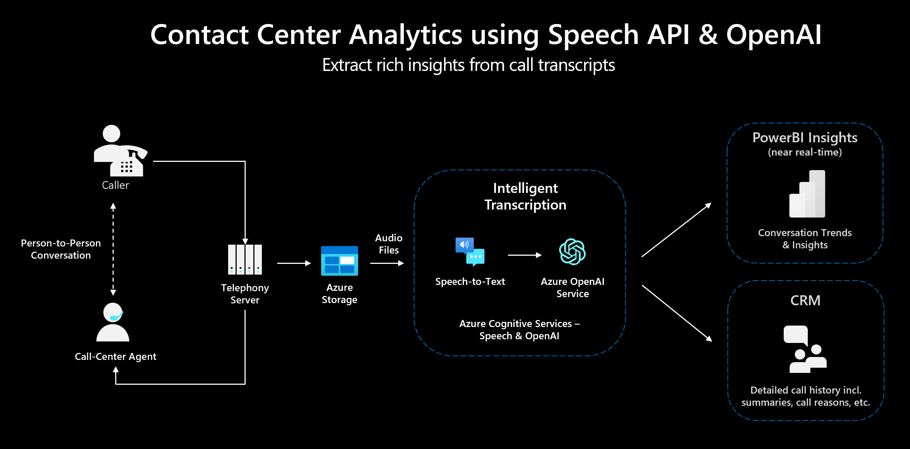

# Bloque 3: Analisis de llamadas de un call center

Como ejemplo, puedes utilizar el audio (mp3) de este repositorio. Pero verás que podríamos aplicar estos dos pasos a cualquier otro audio que tengas y quieras analizar, o que puedes grabar el audio en el Speech Studio directamente con tu micrófono. 



Antes de empezar, recuerda que:

* Tienes que descargarte el audio de ejemplo (u otro) a tu PC local y tenlo a mano porque vamos a transcribirlo a texto con Azure Speech-to-text. 
* Necesitarás un recurso Azure Speech creado, y deberás tener acceso a él
* Necesitarás también acceso a OpenAI, sea Azure OpenAI (en una subscripcion de Azure) o OpenAI en abierto 
___

## Parte 1 - Transcribir audio (Speech-to-text)

En este apartado deberás ir al servicio de Azure Speech Studio y transcribir el audio a texto:

Para ir al Speech Studio, la url es [https://speech.microsoft.com/](https://speech.microsoft.com/)
* Haz login con tus credenciales de Azure
* Selecciona el recurso sobre el que vamos a hacer las peticiones
* Usando la funcionalidad "Real-time Speech-to-text", selecciona como idioma el Español, sube el audio que tienes en tu PC, y verás que se empieza a transcribir a texto. Puedes ir oyendo el audio mientras se va transcribiendo a texto. 
* Una vez haya terminado la transcripción, copia el texto que aparezca como resultado. 
* Verás que tenemos el JSON y más opciones de consumo de los modelos, pero para este caso lo vamos a mantener tan sencillo como copiar el texto directamente.  

Usaremos ese texto en la Parte 2


<details>
  <summary>:white_check_mark: Ver solución:</summary>

* Texto que extraemos con Speech-to-text del audio de ejemplo:

  ```    
  Hola, acabo de tener un accidente y quería notificarlo. Hola. De acuerdo, espero que esté bien, ¿qué ha pasado? Estaba conduciendo por la carretera de Colmenar y me he dado un golpe con otro coche. ¿Está usted bien? Sí, solo un poco nervioso. Es normal. ¿Me puede decir su nombre completo? Claro, me llamo Álvaro Gómez Rodríguez. ¿Sabe cuál ha sido la causa del accidente? Creo que he golpeado un bache. De acuerdo. ¿Dónde se ha producido el accidente? En la carretera de Colmenar pasada la salida 17. ¿Ha habido algún otro herido? Creo que no, pero no estoy seguro. De acuerdo, lo investigaremos. ¿Me puede dar la información del otro conductor? Sí, su nombre es Juan Delgado Rivera. De acuerdo, un momento, por favor, ¿me puede decir su DNI, por favor? Sí. Es 12345678 F. De acuerdo. ¿Qué daños ha sufrido el coche? Se ha roto el faro delantero derecho y se ha pinchado una rueda. ¿Puede conducir el coche? No lo sé, no, va a venir a recogerlo la grúa. De acuerdo. Necesitaremos inspeccionar el coche. Voy a dar de alta el parte para proceder la petición de inspección y reparación. Perfecto, muchas gracias por su ayuda. 

  ```

</details>

___

## Parte 2 - Diseño de prompt de analisis de la transcripcion

En esta parte, una vez hayamos extraido el texto del documento, vamos a utilizar Azure OpenAI para obtener los campos de información relevantes de la conversación. El objetivo de esta sección es diseñar un prompt con las instrucciones adecuadas para conseguir el siguiente resultado:

resultados= {
    "motivo_llamada": "Notificar un accidente",
    "causa_accidente": "Golpeado un bache",
    "nombre_conductores": ["Álvaro Gómez Rodríguez", "Juan Delgado Rivera"],
    "dni_asegurado": "12345678 F",
    "localizacion": "Carretera de Colmenar",
    "resumen": "Un accidente se produjo en la carretera de Colmenar pasada la salida 17. El conductor Álvaro Gómez Rodríguez golpeó un bache y se dio un golpe con otro coche conducido por Juan Delgado Rivera. El coche de Álvaro Gómez Rodríguez sufrió daños en el faro delantero derecho y una rueda pinchada."
}

<details>
  <summary>:white_check_mark: Ver solución:</summary>
  
Extraiga la siguiente información de la conversación 

1. Motivo de la llamada (key: motivo_llamada)
2. Causa del accidente (key: causa_accidente)
3. Nombres de los conductores como array (key: nombre_conductores)
4. DNI de la persona que llama (key: dni_asegurado)
5. Localización del accidente (key: localizacion)
6. Breve y detallado resumen (key: resumen)

Asegure que todos los campos se contestan de manera breve, por ejemplo, para la localización simplemente el nombre. Contesta en formato JSON utilizando las keys indicadas para cada campo. Formatee el JSON como objecto llamado "resultados". Haga un pretty print del JSON y asegure que esta correctamente cerrado al final.

</details>

___
